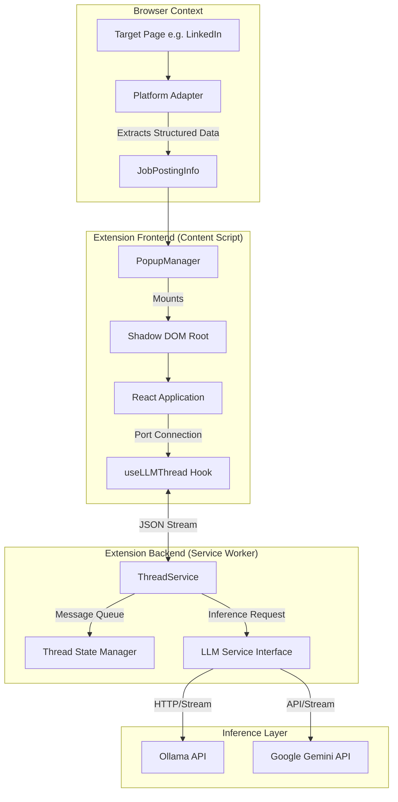

<p align="center">

</p>
<h1 align="center">
SuperFit
</h1>
<p align="center">
Finding your next job is getting easier
<p>


**SuperFit** is a browser-based, privacy-centric AI assistant designed to optimize the job application workflow. It functions as a local automated screener, leveraging Large Language Models (LLMs) to perform semantic analysis of job descriptions against a candidate's professional profile in real-time.

By operating entirely within the browser context and utilizing local inference (via Ollama)

---

## Table of Contents

- [Core Capabilities](#core-capabilities)
- [Technical Architecture](#technical-architecture)
- [Technology Stack](#technology-stack)
- [Installation and Configuration](#installation-and-configuration)
- [Development Workflow](#development-workflow)
- [Project Architecture](#project-architecture)
- [Contributing](#contributing)
- [License](#license)

## Core Capabilities

### 🛡️ Local-First Privacy

SuperFit is engineered with a "Local-First" philosophy. It integrates directly with **Ollama** to run inference on the user's hardware. This architecture eliminates the need to transmit personal identifiable information (PII) to third-party endpoints, ensuring compliance with strict data privacy requirements.

### 🧠 Semantic Gap Analysis

Unlike traditional Applicant Tracking Systems (ATS) that rely on keyword frequency, SuperFit employs Chain-of-Thought (CoT) prompting to evaluate technical competency. It distinguishes between:

- **Explicit Requirements**: Hard skills stated in the job description.
- **Implicit Context**: Seniority levels and domain expertise inferred from the text.
- **Candidate Proficiency**: Validated experience duration and depth based on the provided resume.

### ⚡ Event-Driven Streaming Architecture

The application utilizes a persistent, threaded messaging system between the React frontend and the background service worker. This enables:

- **Real-Time Feedback**: Users observe the model's analytical process ("reasoning steps") as chunks are streamed.
- **State Persistency**: Conversation context is maintained across popup closures, allowing for interactive follow-up questions regarding specific job requirements.

---

## Technology Stack

- **Runtime**: Chrome Manifest V3
- **Language**: TypeScript (Strict Mode)
- **Framework**: React 18
- **Build System**: Vite + CRXJS (Hot Module Replacement supported)
- **UI System**: Material UI (MUI) v5 with Emotion
- **State Management**: React Hooks & Custom Event Propagation
- **Data Validation**: Zod Schema Validation
- **LLM Integration**: Custom Abstraction Layer (Supports Ollama, Gemini)

---

## Installation and Configuration

### Prerequisites

- **Node.js** v18.0.0 or higher
- **pnpm** (Package Manager)
- **Ollama** (For local inference)

### 1. Repository Setup

```bash
git clone https://github.com/yourusername/superfit.git
cd superfit
pnpm install
```

### 2. Application Build

To start the development server with watch mode:

```bash
pnpm dev
```

This will generate a `dist` directory.

### 3. Browser Installation

1.  Navigate to `chrome://extensions/` in Google Chrome.
2.  Enable **Developer mode** in the top-right corner.
3.  Click **Load unpacked**.
4.  Select the `dist` directory from the project root.

### 4. LLM Configuration (Critical)

For the extension to communicate with a locally running Ollama instance, Cross-Origin Resource Sharing (CORS) must be configured.

**MacOS / Linux:**

```bash
OLLAMA_ORIGINS="*" ollama serve
```

**Windows (PowerShell):**

```powershell
$env:OLLAMA_ORIGINS="*"; ollama serve
```

_Note: In production environments, replace wildcard `_` with the distinct extension ID.\*

---

## Development Workflow

### Adding a New Platform Adapter

To extend SuperFit to support a new job board (e.g., Glassdoor), create a new class implementing the `PlatformAdapter` interface in `src/adapters/`:

```typescript
import { PlatformAdapter, JobPostingInfo } from './types'

export class GlassdoorAdapter implements PlatformAdapter {
  name = 'Glassdoor'

  matches(url: string): boolean {
    return url.includes('glassdoor.com/Job')
  }

  isJobPostingPage(): boolean {
    // Logic to verify page type
    return !!document.querySelector('.job-description')
  }

  extractJobInfo(): JobPostingInfo | null {
    // DOM extraction logic
    return {
      // ... mapped data
    }
  }
}
```

Register the adapter in `src/adapters/registry.ts`.

---

## Project Architecture

```
src/
├── adapters/           # DOM parsing strategies for different job sites
├── background/         # Service worker logic (ThreadService, Message Handling)
├── content/            # UI Injection and orchestration logic
│   ├── components/     # React components for the popup
│   └── index.ts        # Content script entry point
├── llm/                # LLM strategy pattern and provider implementations
├── options/            # Extension settings page (Resume upload, LLM config)
├── shared/             # Shared utilities, hooks, and type definitions
└── manifest.ts         # Dynamic manifest generation
```

## Technical Architecture

SuperFit implements a modular Chrome Extension Manifest V3 architecture.



### Component Breakdown

1.  **Platform Adapters**: Strategy pattern implementations that detect specific domains (LinkedIn, Indeed) and normalize DOM structures into a standard `JobPostingInfo` object.
2.  **Shadow DOM Injection**: The UI is injected into a closed Shadow DOM to ensure complete style isolation from the host page, preventing CSS conflicts.
3.  **ThreadService**: A singleton service in the background worker that manages lifecycle, history, and streaming connections for multiple active analysis threads.

---

## Contributing

Contributions are strictly evaluated against code quality standards.

1.  **Fork** the repository.
2.  Create a feature branch (`git checkout -b feature/topic`).
3.  Commit your changes following [Conventional Commits](https://www.conventionalcommits.org/).
4.  Push to the branch.
5.  Open a Pull Request.

Please ensure all new logic is covered by unit tests particularly within the `llm/` and `adapters/` directories.

## License

This project is licensed under the MIT License - see the [LICENSE](LICENSE) file for details.
