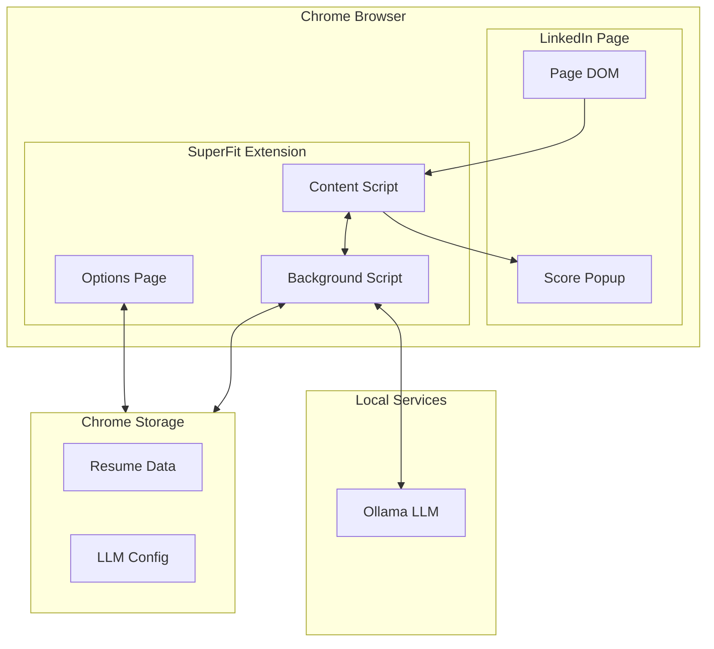

# SuperFit MVP – Introduction

SuperFit is a Chrome extension that empowers job seekers to instantly assess how well they fit a specific job posting on LinkedIn. By leveraging a local LLM (Ollama), SuperFit analyzes the extracted job description and matches it with the user's own resume, presenting a clear qualitative score directly in the job posting page.

## Matching Score Categories

| Score            | Meaning                                      |
|------------------|----------------------------------------------|
| Not Matching     | Resume does not align with job requirements  |
| Barely Matching  | Minimal overlap between resume and job       |
| Likely Matching  | Good alignment with most requirements        |
| Super Fit        | Excellent match across all key requirements  |

## MVP Scope

### In Scope
- Automatic detection of LinkedIn job posting pages
- Extraction of full job description from LinkedIn
- User resume stored locally in Markdown format
- Analysis via local Ollama LLM comparing resume to job
- In-page popup displaying matching score result
- Modular Adapter pattern for platform extensibility
- Provider pattern for LLM extensibility

### Out of Scope (Deferred)
- Additional job platforms (TokyoDev, Indeed, etc.)
- Profile enhancement questions/answers system
- Resume customization suggestions
- Cover letter generation
- Cloud-based LLM providers
- Application tracking features
- Detailed skill gap analysis

## High-Level Architecture

## Extension Component Responsibilities

| Component        | Primary Responsibilities                                                |
|------------------|-------------------------------------------------------------------------|
| Content Script   | DOM interaction, job extraction, popup UI injection/display            |
| Background Script| LLM API communication, storage access, cross-tab session logic         |
| Options Page     | User configuration UI for resume input and LLM model settings          |
