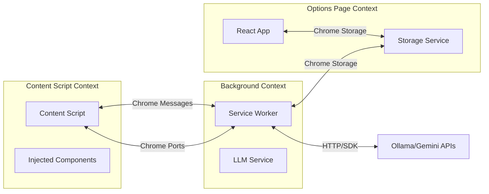

# Phase 1: Foundation

## Objective

Establish the foundational development environment and architectural patterns for SuperFit. This phase focuses on project setup, introducing Material-UI (MUI), and defining clear separation between extension components.

## Technology Stack

| Category          | Technology                   |
| ----------------- | ---------------------------- |
| Language          | TypeScript 5.0+              |
| UI Framework      | React 18+                    |
| Component Library | Material-UI (MUI) v5+        |
| Build Tool        | Vite                         |
| Package Manager   | pnpm                         |
| Extension API     | Chrome Extension Manifest V3 |
| Storage           | Chrome Storage API           |

## Project Structure

```
superfit/
├── src/
│   ├── background/
│   │   └── index.ts              # Background service worker
│   ├── content/
│   │   ├── index.ts              # Content script entry
│   │   └── components/           # Injected UI components
│   ├── options/
│   │   ├── index.tsx             # Options page entry
│   │   ├── pages/                # Page components
│   │   └── components/           # Shared UI components
│   ├── adapters/
│   │   ├── types.ts              # Adapter interfaces
│   │   ├── registry.ts           # Adapter registry
│   │   └── linkedin/             # LinkedIn adapter
│   ├── llm/
│   │   ├── types.ts              # LLM provider interfaces
│   │   ├── registry.ts           # Provider registry
│   │   └── ollama/               # Ollama provider
│   ├── shared/
│   │   ├── types/                # Shared type definitions
│   │   ├── storage/              # Storage utilities
│   │   └── messaging/            # Message passing utilities
│   └── theme/
│       └── index.ts              # MUI theme configuration
├── public/
│   └── manifest.json             # Extension manifest
├── vite.config.ts
├── tsconfig.json
└── package.json
```

## Chrome Extension Architecture


