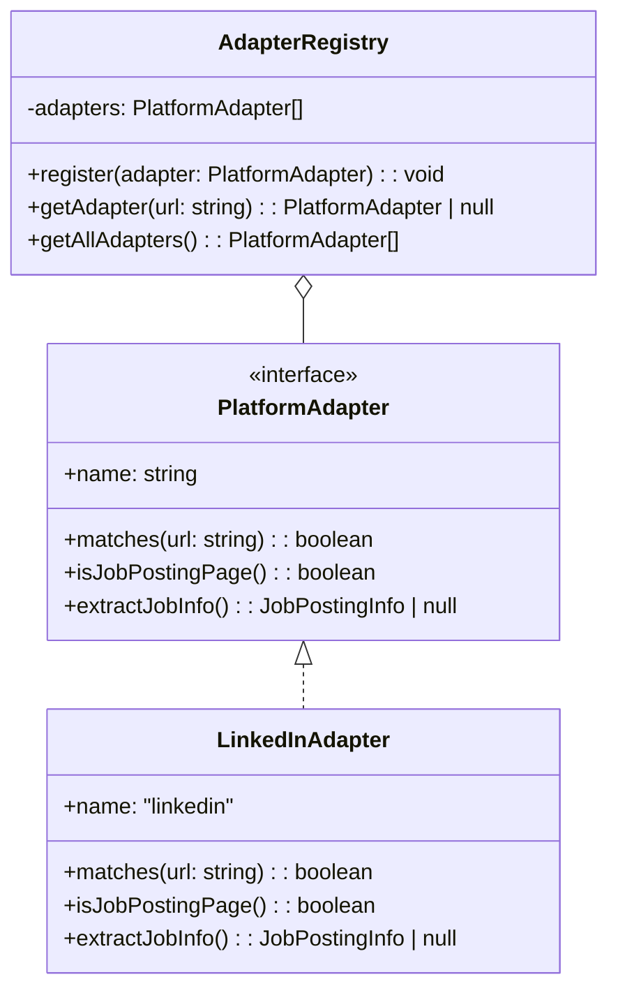
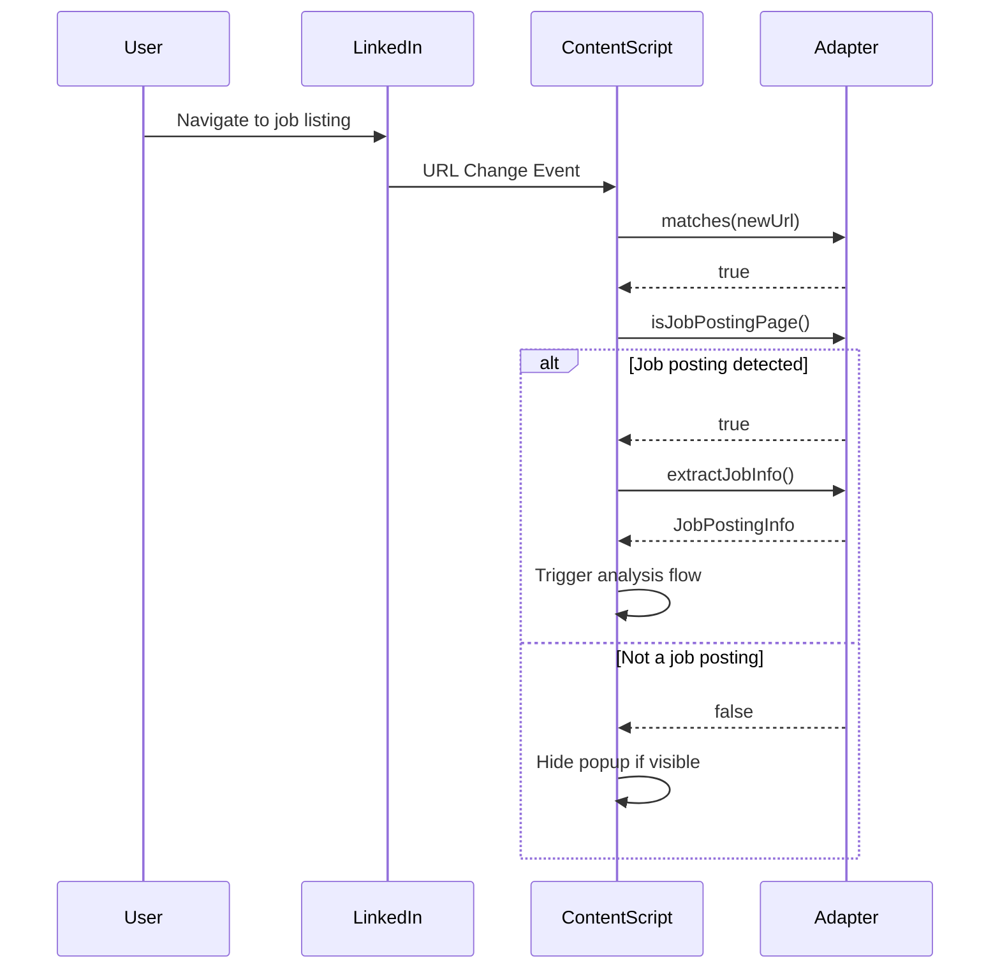
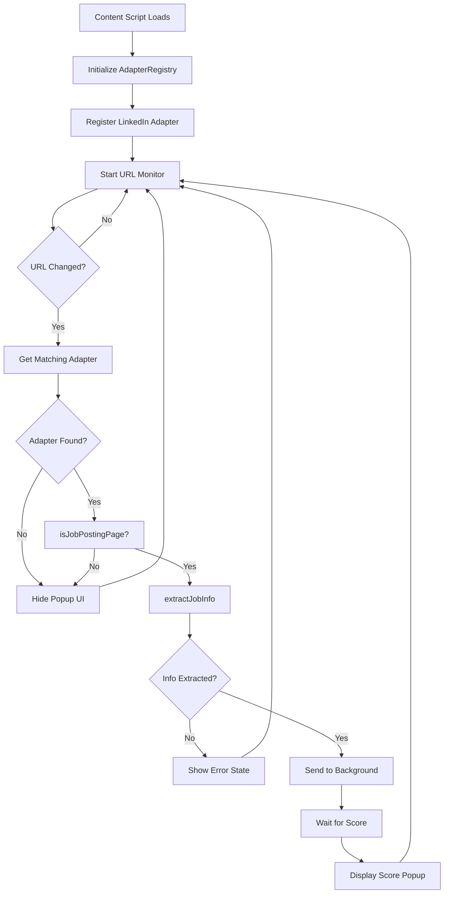

## Objective

Implement the Adapter pattern for robust, extensible detection and extraction of job posting content. For MVP, only LinkedIn is supported, but the architecture enables easy addition of future platforms.

## Architecture Overview



## Interface Specifications

### JobPostingInfo

```typescript
interface JobPostingInfo {
  /** Unique identifier for the job posting */
  id: string
  /** Full URL of the job posting */
  jobUrl: string
  /** Job title */
  jobTitle: string
  /** Full job description text */
  jobDescription: string
  /** Company name (optional for MVP) */
  companyName?: string
}
```

### PlatformAdapter Interface

```typescript
interface PlatformAdapter {
  /** Unique name identifier for the platform */
  readonly name: string

  /**
   * Check if this adapter can handle the given URL
   * @param url - Current page URL
   * @returns true if this adapter should be used
   */
  matches(url: string): boolean

  /**
   * Check if current page is a job posting page
   * Assumes matches() has already returned true
   * @returns true if page contains a job posting
   */
  isJobPostingPage(): boolean

  /**
   * Extract job information from the current page
   * Assumes isJobPostingPage() has returned true
   * @returns JobPostingInfo or null if extraction fails
   */
  extractJobInfo(): JobPostingInfo | null
}
```

### AdapterRegistry Interface

```typescript
interface IAdapterRegistry {
  /**
   * Register a new platform adapter
   */
  register(adapter: PlatformAdapter): void

  /**
   * Get the appropriate adapter for a given URL
   * @returns The matching adapter or null
   */
  getAdapter(url: string): PlatformAdapter | null

  /**
   * Get all registered adapters
   */
  getAllAdapters(): PlatformAdapter[]
}
```

### SPA Navigation Handling



### Navigation Detection Strategy

Implementation should use:

1. popstate event for browser back/forward
2. MutationObserver or polling for SPA navigation
3. Debouncing to prevent excessive callbacks

## Content Script Integration


