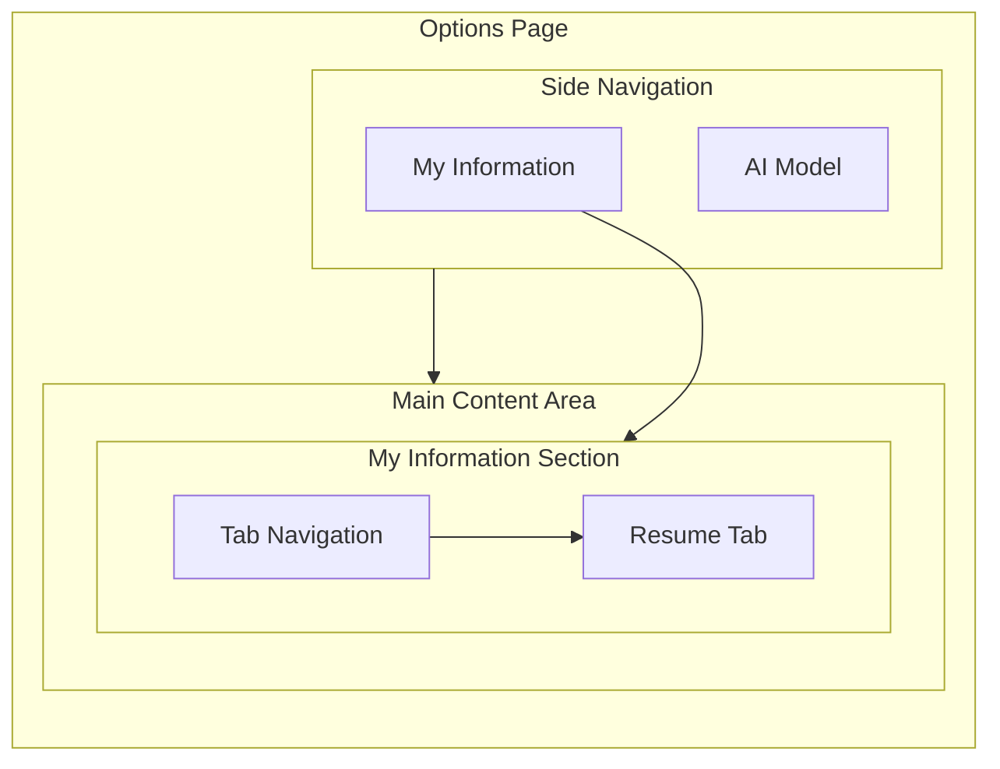
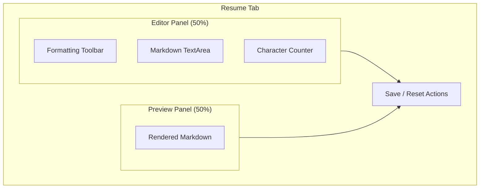
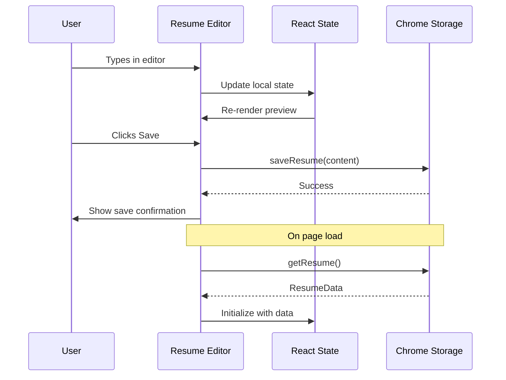

## Objective

Build the Options page section for managing user information. For the MVP, this consists solely of resume input in Markdown format with live preview.

## Options Page Structure



## Navigation Architecture

### Side Navigation

| Menu Item      | Path                      | Description                |
| -------------- | ------------------------- | -------------------------- |
| My Information | `/info/resume` \| `/info` | User resume                |
| AI Model       | `/ai-model`               | LLM provider configuration |

### Tab Navigation (under My Information)

| Tab    | Description                       |
| ------ | --------------------------------- |
| Resume | Markdown editor with live preview |

> Note: Additional tabs (e.g., Questions/Answers) are deferred to post-MVP.

## UI Specifications

### Resume Tab Layout



### Component Specifications

#### MarkdownEditor Component

```typescript
interface MarkdownEditorProps {
  /** Current markdown content */
  value: string

  /** Callback when content changes */
  onChange: (value: string) => void

  /** Maximum character limit */
  maxLength?: number

  /** Placeholder text */
  placeholder?: string

  /** Read-only mode */
  disabled?: boolean
}
```

#### MarkdownPreview Component

```typescript
interface MarkdownPreviewProps {
  /** Markdown content to render */
  content: string

  /** Custom CSS class */
  className?: string
}
```

### UI Behavior

| Interaction           | Behavior                                   |
| --------------------- | ------------------------------------------ |
| Text input            | Immediate update to preview (debounced)    |
| Save button           | Persist to Chrome Storage                  |
| Reset button          | Reload from last saved state               |
| Page leave w/ unsaved | Show confirmation dialog                   |
| Character limit       | Show warning at 90%, prevent input at 100% |

## Storage Specification

### ResumeData Interface

```typescript
// src/shared/types/resume.ts

export interface ResumeData {
  /** Markdown content of the resume */
  markdownContent: string

  /** ISO timestamp of last modification */
  lastModified: string

  /** Data version for future migrations */
  version: number
}
```

### Storage Keys

| Key           | Type       | Description               |
| ------------- | ---------- | ------------------------- |
| `resume_data` | ResumeData | User's resume information |

### Storage Service Interface

```typescript
// src/shared/storage/resume.ts

export interface IResumeStorage {
  /**
   * Get stored resume data
   * @returns ResumeData or null if not set
   */
  getResume(): Promise<ResumeData | null>

  /**
   * Save resume data
   * @param content - Markdown content to save
   */
  saveResume(content: string): Promise<void>

  /**
   * Clear stored resume
   */
  clearResume(): Promise<void>

  /**
   * Check if resume exists
   */
  hasResume(): Promise<boolean>
}
```

## Data Flow



## Validation Rules

| Rule           | Constraint        |
| -------------- | ----------------- |
| Maximum length | 50,000 characters |
| Minimum length | 0 (empty allowed) |
| Content type   | Valid UTF-8 text  |
