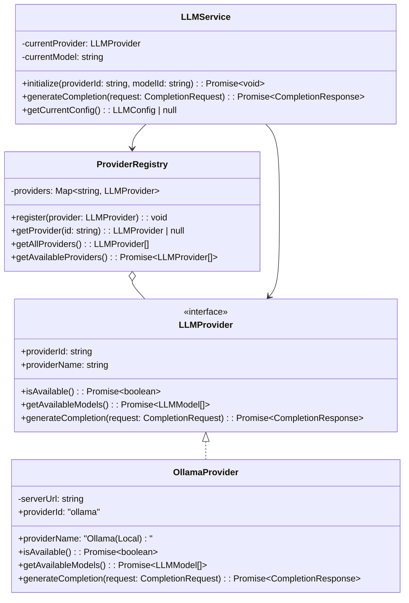
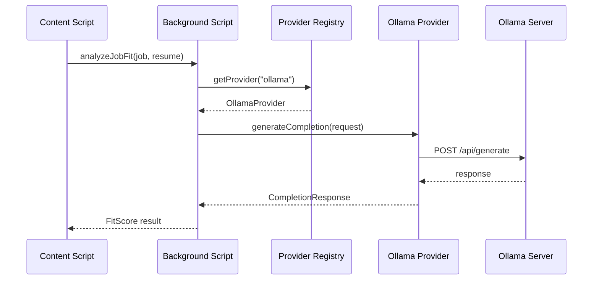

# Phase 4: LLM Provider Interface Design

## Objective

Design a provider-agnostic abstraction layer for LLM integration. For MVP, only Ollama is implemented, but the architecture supports future providers (OpenAI, Anthropic, etc.).

## Architecture Overview



## Interface Specifications

### LLMModel

```typescript
// src/llm/types.ts

export interface LLMModel {
  /** Unique model identifier (e.g., "llama3.2:latest") */
  modelId: string;
  
  /** Human-readable display name */
  displayName: string;
  
  /** Optional description */
  description?:  string;
}
```

### CompletionRequest

```typescript
// src/llm/types. ts

export interface CompletionRequest {
  /** The prompt to send to the model */
  prompt: string;
  
  /** Model identifier to use */
  model: string;
  
  /** Optional system prompt */
  systemPrompt?: string;
  
  /** Temperature for response randomness (0.0-1.0) */
  temperature?:  number;
}
```

### CompletionResponse

```typescript
// src/llm/types. ts

export interface CompletionResponse {
  /** Generated text response */
  text:  string;
  
  /** Model used for generation */
  model: string;
  
  /** Whether generation completed successfully */
  success: boolean;
  
  /** Error message if success is false */
  error?: string;
}
```

### LLMProvider Interface

```typescript
// src/llm/types.ts

export interface LLMProvider {
  /** Unique identifier for this provider */
  readonly providerId: string;
  
  /** Human-readable provider name */
  readonly providerName: string;
  
  /**
   * Check if provider is available and properly configured
   */
  isAvailable(): Promise<boolean>;
  
  /**
   * Get list of models available from this provider
   */
  getAvailableModels(): Promise<LLMModel[]>;
  
  /**
   * Generate a completion using the specified model
   */
  generateCompletion(request: CompletionRequest): Promise<CompletionResponse>;
  
  /**
   * Get configuration options for this provider
   */
  getConfigSchema(): ProviderConfigSchema;
  
  /**
   * Update provider configuration
   */
  configure(config: Record<string, unknown>): Promise<void>;
}
```

### Provider Configuration Schema

```typescript
// src/llm/types.ts

export interface ProviderConfigSchema {
  fields: ProviderConfigField[];
}

export interface ProviderConfigField {
  /** Field key in config object */
  key: string;
  
  /** Display label */
  label:  string;
  
  /** Field type */
  type: 'text' | 'url' | 'password' | 'number' | 'boolean';
  
  /** Whether field is required */
  required: boolean;
  
  /** Default value */
  defaultValue?: unknown;
  
  /** Help text */
  description?: string;
}
```

## Provider Registry

```typescript
// src/llm/registry.ts

export interface IProviderRegistry {
  /**
   * Register a new LLM provider
   */
  register(provider: LLMProvider): void;
  
  /**
   * Get a provider by ID
   */
  getProvider(providerId: string): LLMProvider | null;
  
  /**
   * Get all registered providers
   */
  getAllProviders(): LLMProvider[];
  
  /**
   * Get all available (configured and reachable) providers
   */
  getAvailableProviders(): Promise<LLMProvider[]>;
}
```

## LLM Service

```typescript
// src/llm/service.ts

export interface ILLMService {
  /**
   * Initialize service with a specific provider and model
   */
  initialize(providerId: string, modelId: string): Promise<void>;
  
  /**
   * Generate completion using current configuration
   */
  generateCompletion(
    request:  Omit<CompletionRequest, 'model'>
  ): Promise<CompletionResponse>;
  
  /**
   * Get current configuration
   */
  getCurrentConfig(): LLMConfig | null;
  
  /**
   * Load configuration from storage
   */
  loadFromStorage(): Promise<void>;
}

export interface LLMConfig {
  providerId: string;
  modelId: string;
  updatedAt: string;
}
```

## Ollama Provider Specification

### Configuration

```typescript
interface OllamaConfig {
  /** Ollama server URL (default: http://localhost:11434) */
  serverUrl:  string;
}
```

### API Endpoints Used

| Endpoint            | Method | Purpose                      |
|---------------------|--------|------------------------------|
| `/api/tags`         | GET    | List available models        |
| `/api/generate`     | POST   | Generate completion          |

### Ollama API Request/Response

```typescript
// GET /api/tags response
interface OllamaTagsResponse {
  models: Array<{
    name: string;
    modified_at: string;
    size: number;
  }>;
}

// POST /api/generate request
interface OllamaGenerateRequest {
  model: string;
  prompt: string;
  system?: string;
  stream:  false;  // MVP uses non-streaming
  options?: {
    temperature?:  number;
  };
}

// POST /api/generate response
interface OllamaGenerateResponse {
  model: string;
  response: string;
  done: boolean;
}
```

## Background Script Integration



## Storage Specification

### LLM Configuration Storage

```typescript
// Storage key: "llm_config"

interface StoredLLMConfig {
  providerId: string;
  modelId: string;
  providerConfigs: {
    [providerId: string]: Record<string, unknown>;
  };
  updatedAt: string;
}
```

## Error Handling

| Error Type           | Handling Strategy                              |
|----------------------|------------------------------------------------|
| Connection refused   | Return user-friendly error, suggest checking Ollama |
| Timeout              | Return timeout error, allow retry              |
| Model not found      | Prompt user to select valid model              |
| Invalid response     | Log error, return generic failure              |

## Phase 4 Deliverables

- [ ] `LLMProvider` interface defined
- [ ] `LLMModel`, `CompletionRequest`, `CompletionResponse` types
- [ ] `ProviderRegistry` implemented
- [ ] `LLMService` implemented
- [ ] `OllamaProvider` implemented:
  - [ ] Connection testing
  - [ ] Model listing
  - [ ] Completion generation
- [ ] Storage integration for LLM config
- [ ] Error handling utilities