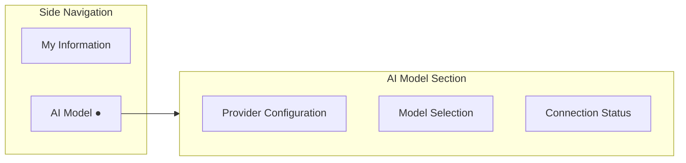
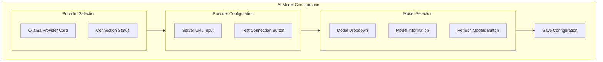
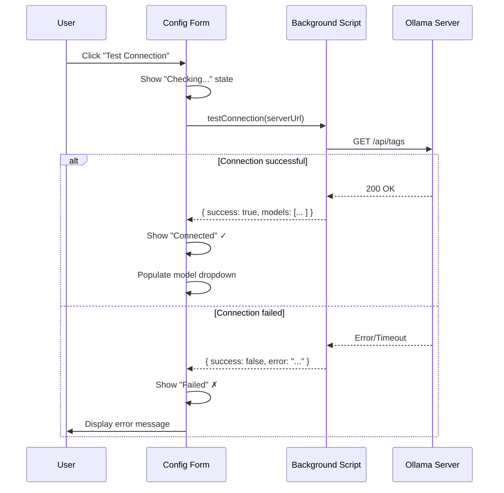
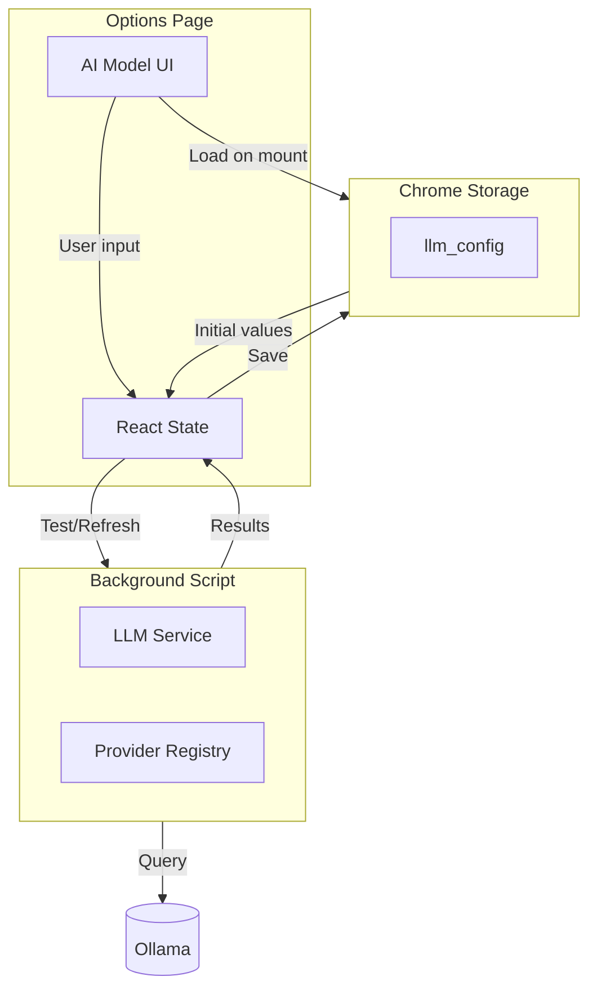

# Phase 5: Options Page – AI Model Configuration

## Objective

Provide a user interface for configuring the LLM provider and model selection.  For MVP, only Ollama is supported, but the UI architecture accommodates future providers. 

## Navigation Context



## UI Layout



## Component Specifications

### ProviderSelector Component

```typescript
interface ProviderSelectorProps {
  /** List of available providers */
  providers: ProviderInfo[];
  
  /** Currently selected provider ID */
  selectedProviderId: string | null;
  
  /** Callback when provider is selected */
  onSelect: (providerId:  string) => void;
}

interface ProviderInfo {
  providerId: string;
  providerName:  string;
  description: string;
  isAvailable:  boolean;
  status: 'connected' | 'disconnected' | 'checking';
}
```

### ProviderConfigForm Component

```typescript
interface ProviderConfigFormProps {
  /** Configuration schema from provider */
  schema: ProviderConfigSchema;
  
  /** Current configuration values */
  values: Record<string, unknown>;
  
  /** Callback when values change */
  onChange: (values: Record<string, unknown>) => void;
  
  /** Callback to test connection */
  onTestConnection: () => Promise<boolean>;
  
  /** Current connection status */
  connectionStatus: 'connected' | 'disconnected' | 'checking';
}
```

### ModelSelector Component

```typescript
interface ModelSelectorProps {
  /** Available models from provider */
  models: LLMModel[];
  
  /** Currently selected model ID */
  selectedModelId: string | null;
  
  /** Callback when model is selected */
  onSelect: (modelId: string) => void;
  
  /** Callback to refresh model list */
  onRefresh: () => Promise<void>;
  
  /** Loading state */
  isLoading: boolean;
  
  /** Whether provider is connected */
  isProviderConnected: boolean;
}
```

## UI States

### Provider Card States

| State        | Visual Indicator                          |
|--------------|-------------------------------------------|
| Available    | Green checkmark, "Connected" label        |
| Unavailable  | Red X, "Not Connected" label              |
| Checking     | Spinner, "Checking..." label              |

### Model Dropdown States

| State              | Behavior                                |
|--------------------|-----------------------------------------|
| Provider connected | Shows model list, enabled               |
| Provider disconnected | Disabled, shows "Connect provider first" |
| Loading models     | Shows spinner                           |
| No models          | Shows "No models found"                 |

## Ollama-Specific UI

### Configuration Fields

| Field       | Type  | Default                    | Required |
|-------------|-------|----------------------------|----------|
| Server URL  | URL   | `http://localhost:11434`   | Yes      |

### Test Connection Flow



## Data Flow



## Message API

### Messages from Options Page to Background

```typescript
// Test provider connection
interface TestConnectionMessage {
  type: 'TEST_LLM_CONNECTION';
  payload: {
    providerId: string;
    config: Record<string, unknown>;
  };
}

interface TestConnectionResponse {
  success: boolean;
  error?: string;
}

// Get available models
interface GetModelsMessage {
  type: 'GET_LLM_MODELS';
  payload:  {
    providerId: string;
  };
}

interface GetModelsResponse {
  success: boolean;
  models?:  LLMModel[];
  error?: string;
}
```

## Validation Rules

| Field       | Validation                                   |
|-------------|----------------------------------------------|
| Server URL  | Must be valid URL, must start with http(s):// |
| Model       | Must be selected from available list         |

## Phase 5 Deliverables

- [ ] AI Model section in Options page
- [ ] ProviderSelector component (Ollama only for MVP)
- [ ] ProviderConfigForm component
- [ ] ModelSelector component
- [ ] Connection testing functionality
- [ ] Model list refresh functionality
- [ ] Configuration persistence to storage
- [ ] Background script message handlers
- [ ] Error state handling and display