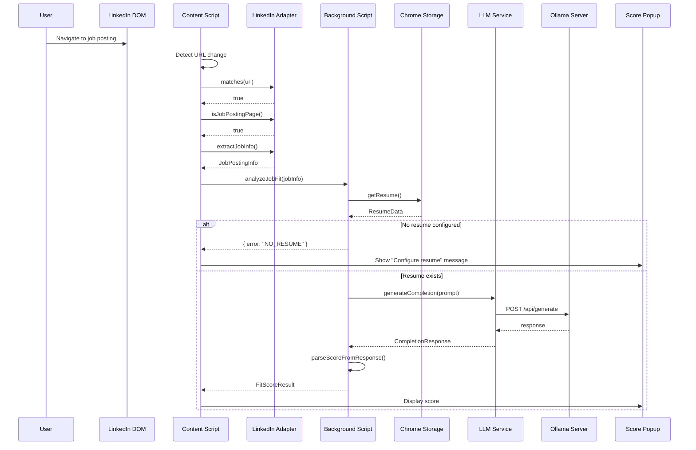
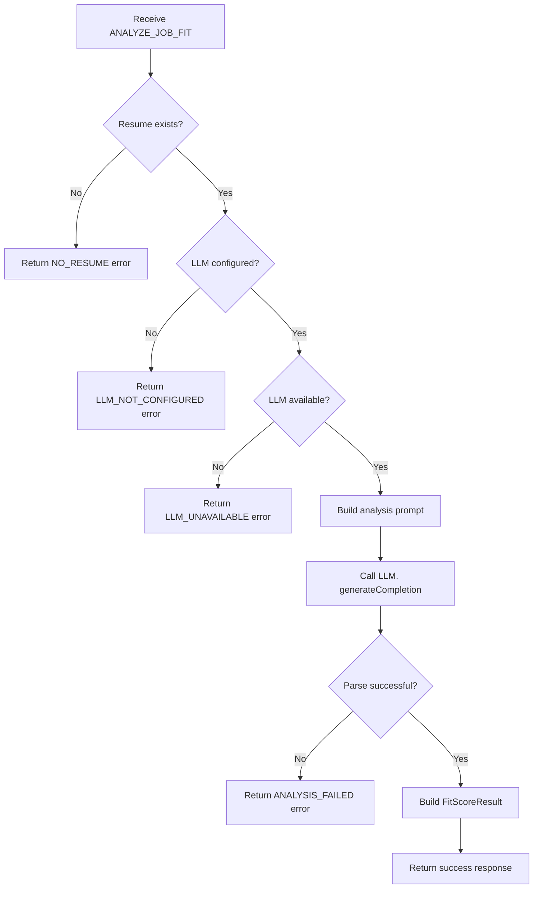
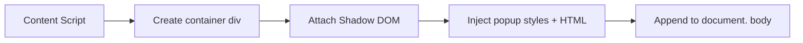

# Phase 6: Job Fit Scoring & Popup

## Objective

Implement the core user-facing feature: analyzing job-resume fit and displaying the score in an in-page popup on LinkedIn job postings.

## Fit Score Categories

| Score           | Value | Description                                 |
| --------------- | ----- | ------------------------------------------- |
| Not Matching    | 1     | Resume does not align with job requirements |
| Barely Matching | 2     | Minimal overlap, significant gaps           |
| Likely Matching | 3     | Good alignment with most requirements       |
| Super Fit       | 4     | Excellent match across all key requirements |

```typescript
// src/shared/types/scoring.ts

export type FitScoreLevel = "NOT_MATCHING" | "BARELY_MATCHING" | "LIKELY_MATCHING" | "SUPER_FIT";

export interface FitScoreResult {
  /** Score level */
  level: FitScoreLevel;

  /** Numeric value (1-4) */
  value: number;

  /** Display label */
  label: string;

  /** ISO timestamp of analysis */
  analyzedAt: string;

  /** Job ID this score is for */
  jobId: string;
}
```

## Complete User Flow



## LLM Prompt Specification

### System Prompt

```
You are a job-resume matching assistant. Your task is to evaluate how well a candidate's resume matches a job description.  You must respond with ONLY one of these four exact phrases:

- "Not matching" - Resume does not align with job requirements
- "Barely Matching" - Minimal overlap between resume and job
- "Likely Matching" - Good alignment with most requirements
- "Super fit" - Excellent match across all key requirements

Do not include any other text, explanation, or formatting in your response.
```

### User Prompt Template

```
Evaluate how well this resume matches the job description.

## Job Title
{jobTitle}

## Job Description
{jobDescription}

## Candidate Resume
{resumeContent}

Respond with only one of:  "Not matching", "Barely Matching", "Likely Matching", or "Super fit"
```

### Response Parsing

```typescript
// src/shared/scoring/parser.ts

export function parseScoreFromResponse(response: string): FitScoreLevel {
  const normalized = response.toLowerCase().trim();

  if (normalized.includes("super fit")) {
    return "SUPER_FIT";
  }
  if (normalized.includes("likely matching")) {
    return "LIKELY_MATCHING";
  }
  if (normalized.includes("barely matching")) {
    return "BARELY_MATCHING";
  }
  // Default to not matching if unable to parse
  return "NOT_MATCHING";
}
```

## Message API

### Content Script → Background

```typescript
// Request job fit analysis
interface AnalyzeJobFitMessage {
  type: "ANALYZE_JOB_FIT";
  payload: {
    jobInfo: JobPostingInfo;
  };
}

interface AnalyzeJobFitResponse {
  success: boolean;
  result?: FitScoreResult;
  error?: AnalysisError;
}

type AnalysisError =
  | { code: "NO_RESUME"; message: string }
  | { code: "LLM_NOT_CONFIGURED"; message: string }
  | { code: "LLM_UNAVAILABLE"; message: string }
  | { code: "ANALYSIS_FAILED"; message: string };
```

## Background Script Logic



## Popup UI Specification

### Visual Design

```
┌─────────────────────────────────────┐
│ SuperFit                    [×]    │
├─────────────────────────────────────┤
│                                     │
│     ████████████████████            │
│                                     │
│         🎯 Super Fit                │
│                                     │
│   This job is a great match!        │
│                                     │
└─────────────────────────────────────┘
```

### Popup States

| State           | Display                                          |
| --------------- | ------------------------------------------------ |
| Loading         | Spinner with "Analyzing..."                      |
| Super Fit       | Green indicator, positive message                |
| Likely Matching | Blue indicator, encouraging message              |
| Barely Matching | Yellow indicator, neutral message                |
| Not Matching    | Gray indicator, informative message              |
| Error           | Error icon, message, action button if applicable |

### Score Display Component

```typescript
interface ScorePopupProps {
  /** Current state of the popup */
  state: "loading" | "success" | "error";

  /** Score result (when state is 'success') */
  result?: FitScoreResult;

  /** Error info (when state is 'error') */
  error?: AnalysisError;

  /** Callback when close button clicked */
  onClose: () => void;

  /** Callback for error action button */
  onErrorAction?: () => void;
}
```

### Visual Indicators per Score

| Score           | Color   | Icon | Message                      |
| --------------- | ------- | ---- | ---------------------------- |
| Super Fit       | #4caf50 | 🎯   | "This job is a great match!" |
| Likely Matching | #2196f3 | ✓    | "Good potential match"       |
| Barely Matching | #ff9800 | ⚠    | "Some skills overlap"        |
| Not Matching    | #9e9e9e | ✗    | "May not be the best fit"    |

## Content Script Popup Injection

### Injection Strategy

```typescript
interface PopupManager {
  /**
   * Show the score popup with loading state
   */
  showLoading(): void;

  /**
   * Update popup with score result
   */
  showResult(result: FitScoreResult): void;

  /**
   * Show error state
   */
  showError(error: AnalysisError): void;

  /**
   * Hide and remove the popup
   */
  hide(): void;

  /**
   * Check if popup is currently visible
   */
  isVisible(): boolean;
}
```

### Popup Positioning

- Fixed position in viewport (e.g., bottom-right corner)
- Does not interfere with LinkedIn UI
- Draggable (optional, nice-to-have)
- Responsive to viewport changes

### DOM Injection



Using Shadow DOM ensures style isolation from LinkedIn's CSS.

## Error Handling UI

### Error States and Actions

| Error Code         | User Message                                  | Action Button   |
| ------------------ | --------------------------------------------- | --------------- |
| NO_RESUME          | "Set up your resume to get started"           | "Open Settings" |
| LLM_NOT_CONFIGURED | "Configure AI model to analyze jobs"          | "Open Settings" |
| LLM_UNAVAILABLE    | "Could not connect to AI. Is Ollama running?" | "Retry"         |
| ANALYSIS_FAILED    | "Analysis failed. Please try again"           | "Retry"         |

## Caching Strategy (Optional Enhancement)

```typescript
// Cache recent analyses to avoid redundant LLM calls
interface AnalysisCache {
  /**
   * Get cached result for a job
   */
  get(jobId: string): FitScoreResult | null;

  /**
   * Store result in cache
   */
  set(jobId: string, result: FitScoreResult): void;

  /**
   * Clear all cached results
   */
  clear(): void;
}

// Cache duration:  1 hour (configurable)
// Storage: In-memory in background script
```

## Phase 6 Deliverables

- [ ] Score parsing logic
- [ ] LLM prompt templates
- [ ] Background script analysis handler
- [ ] Message API implementation
- [ ] Popup UI component (with Shadow DOM)
- [ ] PopupManager for injection/removal
- [ ] All popup states (loading, scores, errors)
- [ ] Error action handling (open settings, retry)
- [ ] Style isolation from LinkedIn
- [ ] Integration testing with LinkedIn job pages
